# Energy Demo - User Manual

## Table of Contents
1. [Introduction](#introduction)
2. [Getting Started](#getting-started)
3. [Architecture Overview](#architecture-overview)
4. [Demo Interface](#demo-interface)
5. [Controls](#controls)
6. [Device Information](#device-information)
7. [Energy & Pricing](#energy--pricing)
8. [Demo Scenarios](#demo-scenarios)
9. [Deployments & Modules](#deployments--modules)
10. [Communication & Queries](#communication--queries)
11. [Quick Reference](#quick-reference)

---

## Introduction

The **Energy Demo** is an interactive demonstration of an intelligent energy management system powered by Liquid AI technology. This user manual will guide you through all features and functionality of the demo application.

### What You'll Learn
- How to navigate the demo interface
- Understanding the architecture visualization
- Controlling the demo simulation
- Interpreting device schedules and energy data
- Exploring different demo scenarios

---

## Getting Started

### Welcome Page

When you first access the Energy Demo, you'll be greeted by the Welcome Page.

**Features of the Welcome Page:**
- **Title**: "Welcome to the Energy Demo with LiquidAI"
- **Description**: Brief explanation of the demo's purpose and capabilities
- **Links**: Access to Liquid Software project information and GitHub repository
- **Start Button**: Click this button to enter the main demo interface

> **Tip**: If you see "development version" in red text, you are accessing a test/staging environment.

---

## Architecture Overview

The demo visualizes the system architecture in three different views to help you understand how components interact.

### Cloud Architecture

This view shows the traditional cloud-based architecture without Liquid AI optimization.

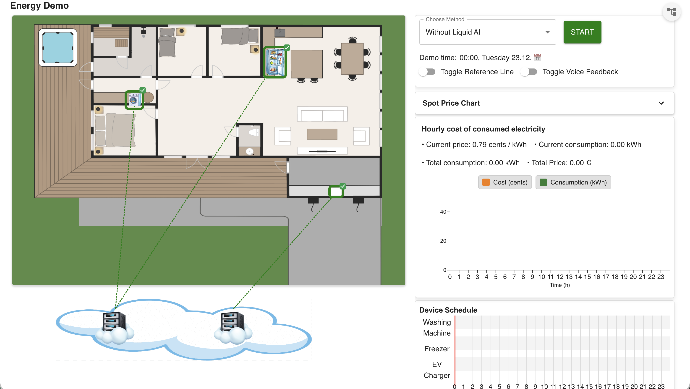

**Key Components:**
- External service providers communicate directly with home devices
- Data flows through cloud servers to reach the smart home
- Traditional centralized control model

### Liquid Architecture

This view demonstrates the Liquid AI-powered architecture with intelligent edge computing.

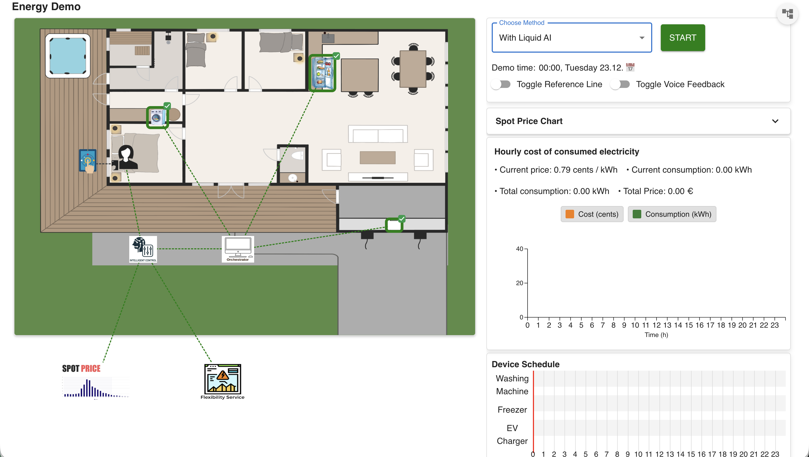

**Key Components:**
- **Orchestrator**: Central hub that coordinates all WASM module deployments
- **Intelligent Control**: AI component that calculates optimal schedules
- **Flexibility Service**: Monitors electricity prices for changes
- **Supervisors**: Edge devices running on smart home appliances
- **Database**: Stores modules, manifests, and deployment data

### Architecture View (Liquid based)

To access the architecture view, click on the "Architecture View" button in the top-right corner of the main demo interface.

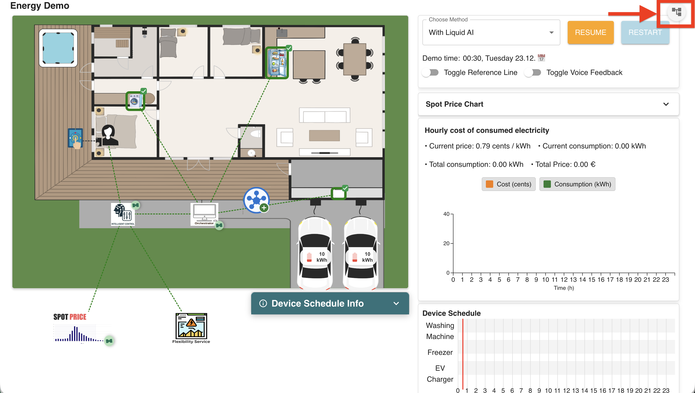

The full architecture diagram showing all system components and their connections.

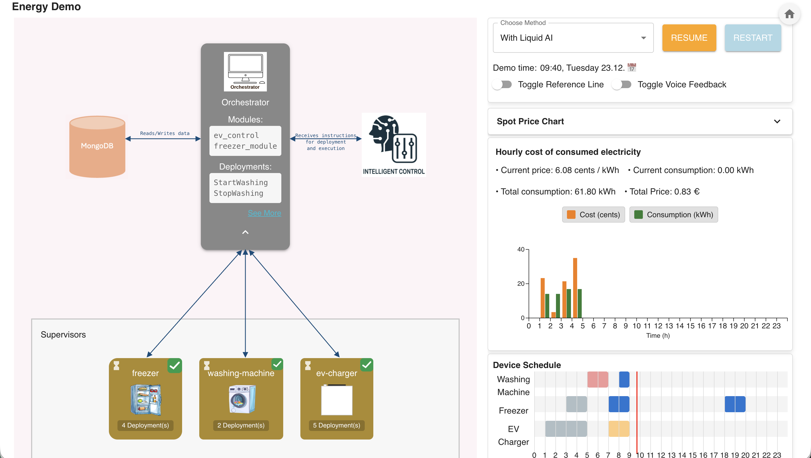

**What You Can See:**
- Smart home with connected devices (Freezer, Washing Machine, EV Charger)
- Backend infrastructure (Orchestrator, Database, Intelligent Control)
- Data flow connections between all components

---

## Demo Interface

### Base View

The initial state of the demo before simulation begins.

**Interface Elements:**
- **Left Panel**: Home diagram showing all connected components
- **Top Bar**: Demo controls 
- **Center Right**: Electricity price and consumption chart
- **Bottom Right**: Device schedule chart (empty at start)

### Running Demo

The demo in action, showing animated data flow between components.

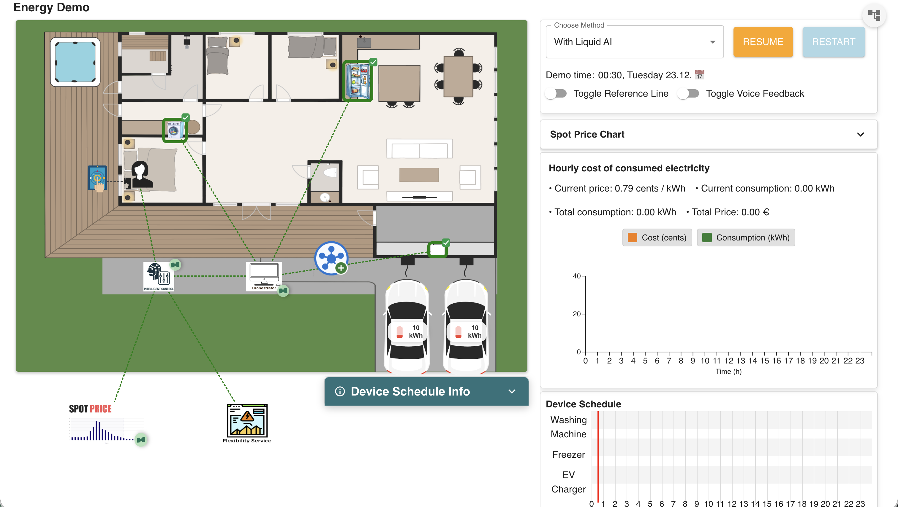
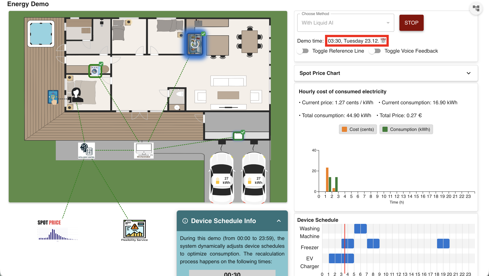
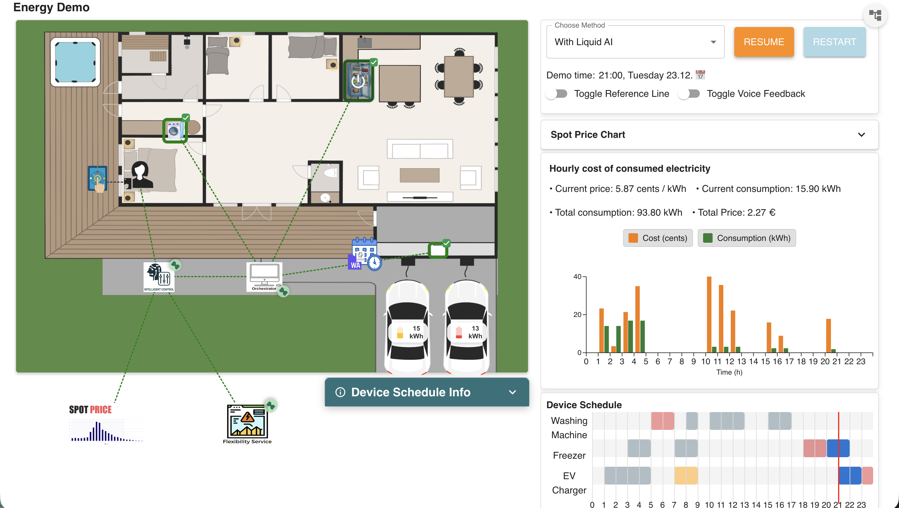

**During the Demo:**
- Animated icons show data moving between components
- Device schedules update in real-time
- Energy consumption is tracked and displayed
- The demo clock advances through a simulated 24-hour period

### Supervisors Location

This view highlights where Supervisors are installed in the smart home.

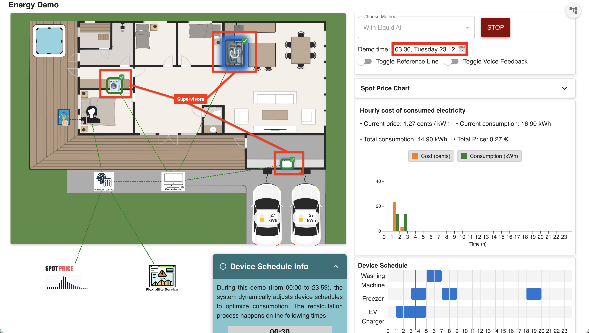

**Supervisor Locations:**
- **Washing Machine**: Controls washing cycles and energy consumption
- **Freezer**: Manages temperature and operating schedules
- **EV Charger**: Handles vehicle charging and V2G (Vehicle-to-Grid) functionality

> **Note**: Supervisors are edge devices that execute WASM modules locally, enabling intelligent device control.

### Demo Time Display

The demo clock shows the current simulated time.

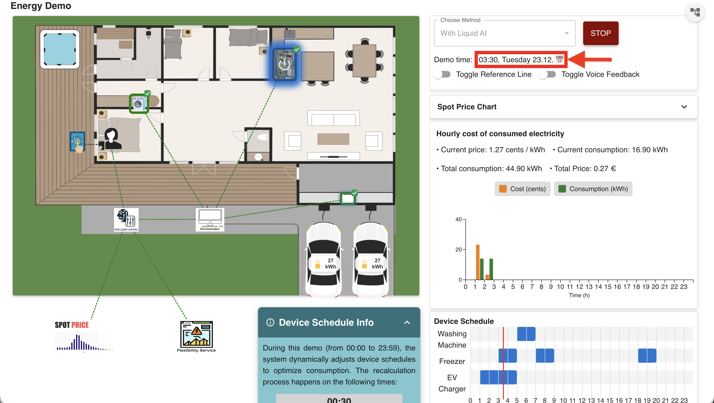

**Time Display Features:**
- 24-hour format display
- Simulated time advances faster than real-time
- Key events trigger at specific times throughout the day

---

## Controls

### Stop Button

Pause the demo simulation at any time.

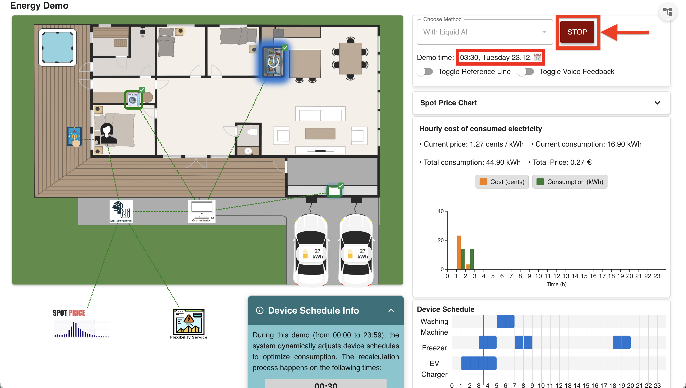

**When to Use:**
- To pause and examine the current state
- To stop animations for closer inspection
- Before restarting or changing settings

### Resume/Restart

Continue or restart the demo simulation.

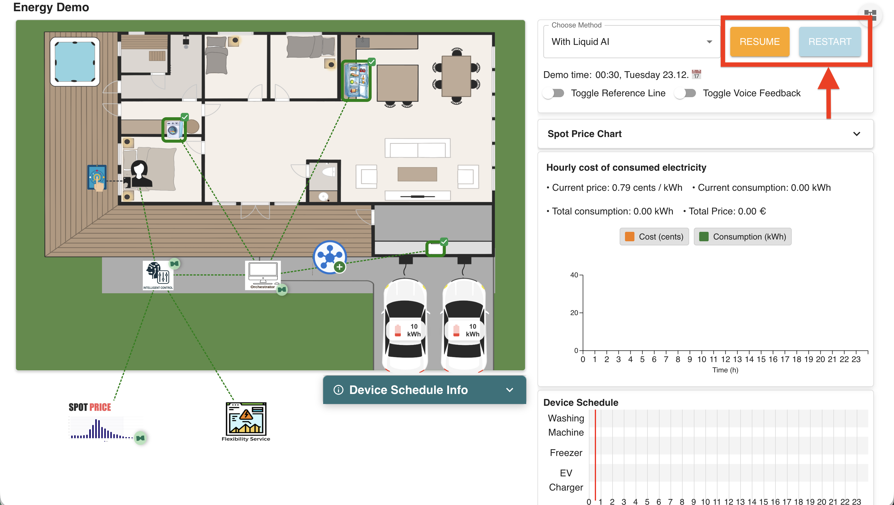

**Control Options:**
- **Resume**: Continue from where you paused
- **Restart**: Reset the demo to 00:00 and start fresh

### Voice Feedback

Enable or disable spoken narration of demo events.

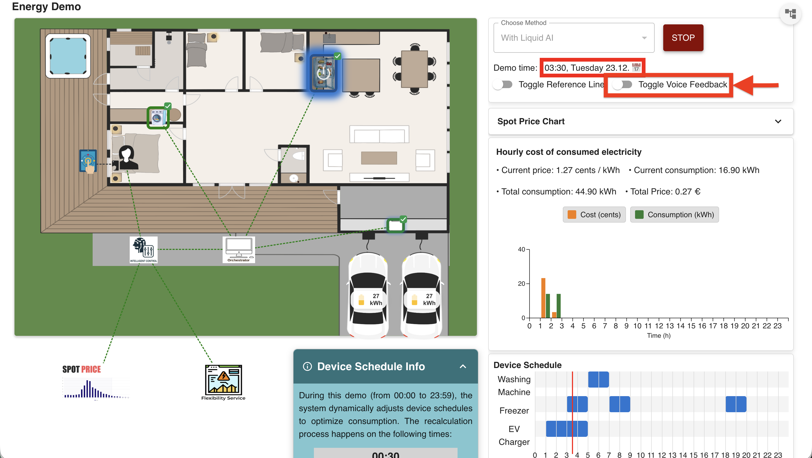

**Voice Feedback Narrates:**
- Device connections (e.g., "Electric cars are available for charging")
- Price spike alerts
- Rescheduling notifications
- Power outage events
- V2G activation

### Reference Line Toggle

Show or hide the chart reference line on all the available charts.

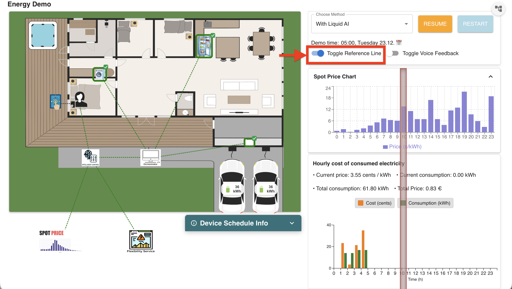

**Reference Line Features:**
- Helps to compare the current state of the charts with each other.
- Provides ease of navigation through the charts.

---

## Schedule Information

### Device Schedule Chart

Visual representation of when each device operates throughout the day.

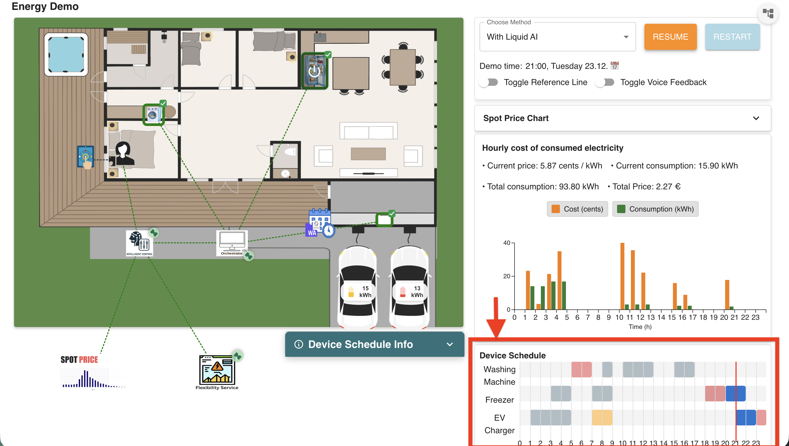

**Schedule Chart Elements:**
- **Red line**: Indicates current demo time, helps track progress through the schedule and shows which device operations are active.
- **Rows**: Each row represents a device (Freezer, Washing Machine, EV Charger)
- **Blue Bars**: Currently scheduled operations
- **Gray Bars**: Historical/completed operations
- **Orange Bars**: V2G discharging periods (car providing energy)
- **Red Boxes**: Cancelled operations

### Cars Battery Information

Detailed status of electric vehicle batteries.

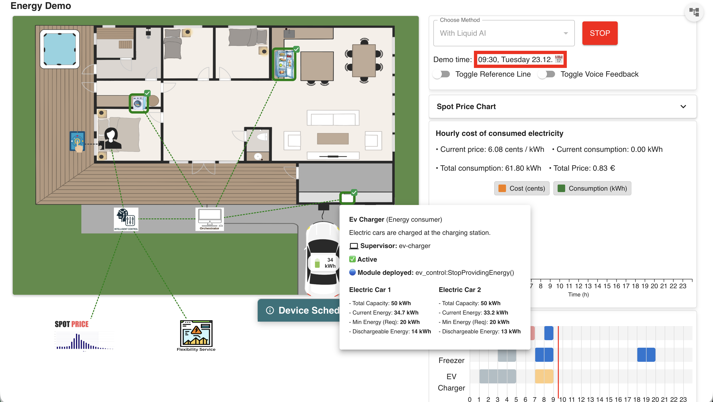

**Battery Information Displayed:**
- **Current Energy**: Total energy stored in the battery (kWh)
- **Dischargeable Energy**: Energy available for V2G (above 20 kWh minimum)
- **Min Req Energy**: The minimum energy required for the car to be able to drive

### Info Panel

Detailed information about rescheduling events and system decisions.

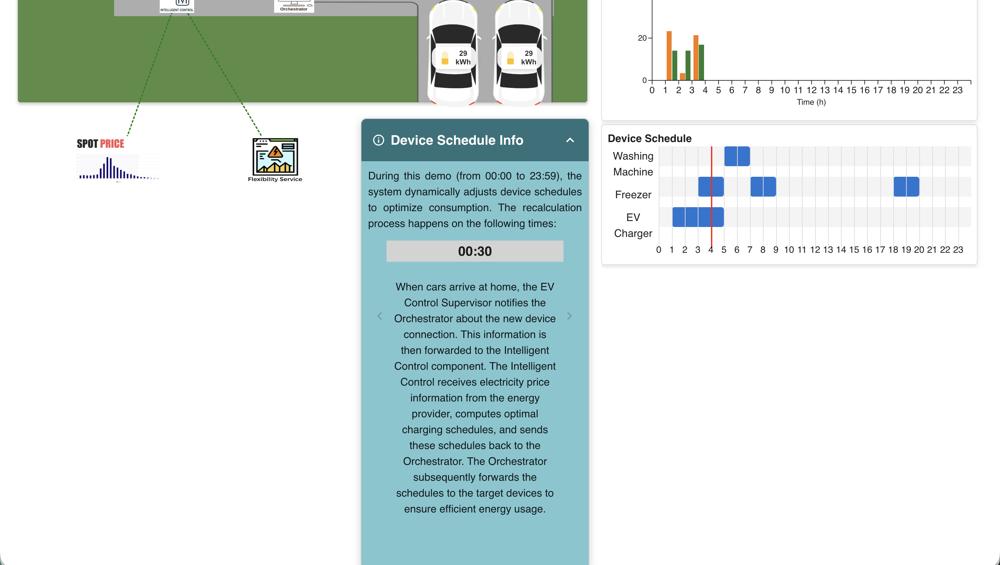

**Panel Contents:**
- Timestamp of each event
- Description of what triggered the rescheduling
- Actions taken by the Intelligent Control
- Current device status updates

---

## Energy & Pricing

### Price and Consumption Chart

Real-time tracking of electricity costs and energy usage.

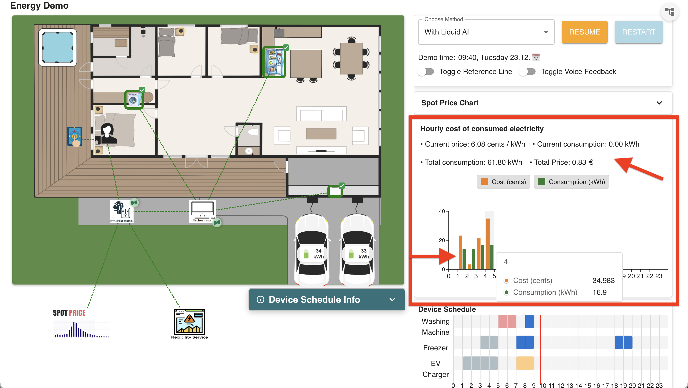

**Chart Information:**
- **Current Price**: Real-time electricity cost (cents/kWh)
- **Current Consumption**: Energy being used this hour
- **Total Consumption**: Accumulated energy usage for the day
- **Total Price**: Total electricity cost
- **Bar Chart**: Hourly breakdown showing cost (orange) and consumption (green)

**Interactive Features:**
- Click legend items to show/hide data series
- Hover over bars for detailed values

---

## Demo Scenarios

The demo simulates several real-world scenarios throughout a 24-hour period.

### Power Outage

Simulation of a grid power failure.

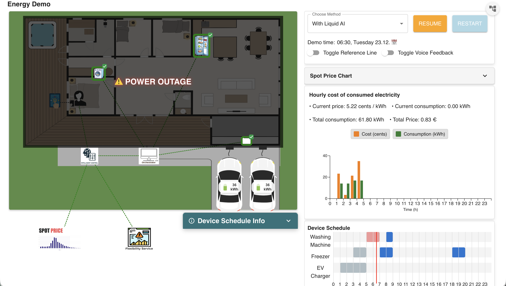

**What Happens:**
- Grid power becomes unavailable (blackout simulation)
- The house visualization indicates power outage state
- Essential devices need backup power

### Energy Providing (V2G)

Electric vehicles provide backup power to home devices during outage.

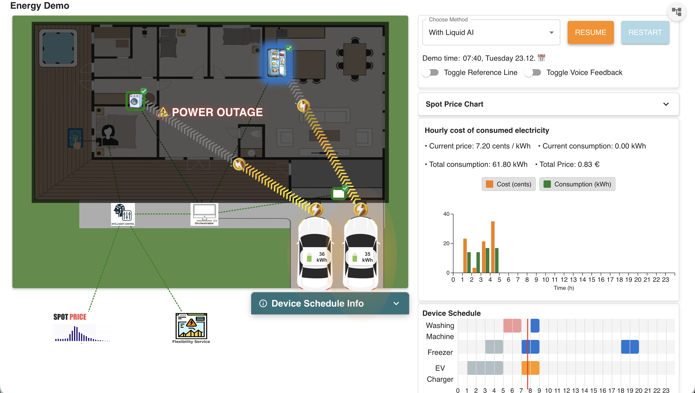

**V2G Features:**
- **Electric Car 2** → Powers the Freezer
- **Electric Car 1** → Powers the Washing Machine
- Orange glow indicates car is providing energy
- Animated lines show energy flow direction
- Car battery levels decrease as energy is provided

**Requirements:**
- Cars must have sufficient battery (above 20 kWh minimum for driving)
- Only "dischargeable energy" is used for V2G

### Final State

The demo at the end of the 24-hour simulation.

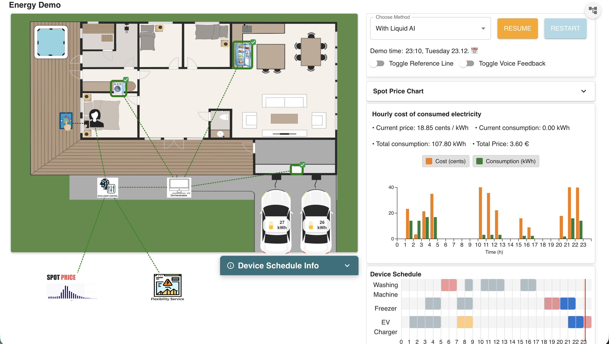

**End of Day Summary:**
- Total energy consumed throughout the day
- Total cost of electricity
- Complete schedule history
- Device state summary

---

## Deployments & Modules

The demo uses WebAssembly (WASM) modules to control devices. This section shows how modules are deployed and executed.

### Modules Deployments

List of WASM modules available for deployment.

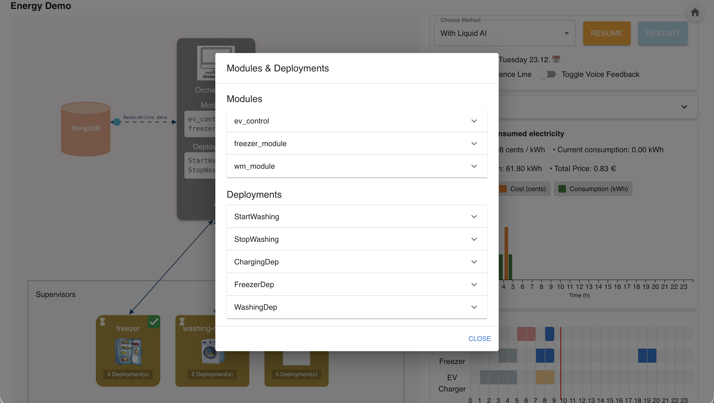

**Available Modules:**
- **ev_control**: Electric vehicle charger management
- **freezer_module**: Freezer control and temperature management
- **wm_module**: Washing machine control

### Executed Deployments

Real-time view of modules that have been deployed and executed.

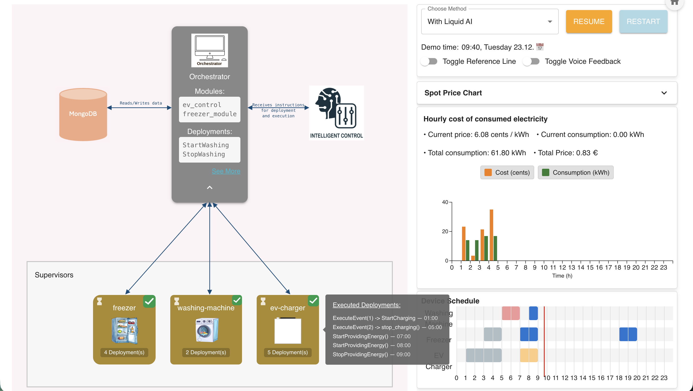

**Deployment Information:**
- Deployment name
- Deployment timestamp

### Recent Deployment

Details of the most recent module deployment.

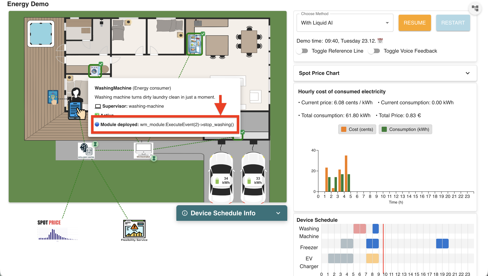

### Execution Progress

Indicates the supervisor is executing the deployment on devices.

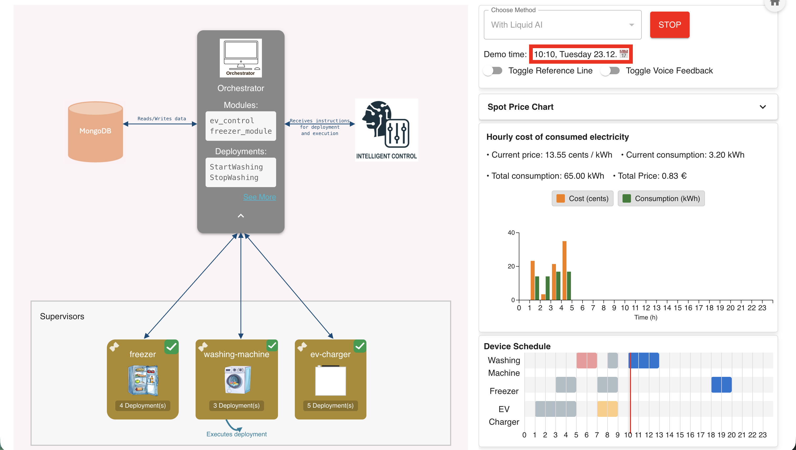

---

## Communication & Queries

Orchestrator can communicate with supervisor devices to get information about their state and to control them.

### Health Check

Monitors the health status of all system components.

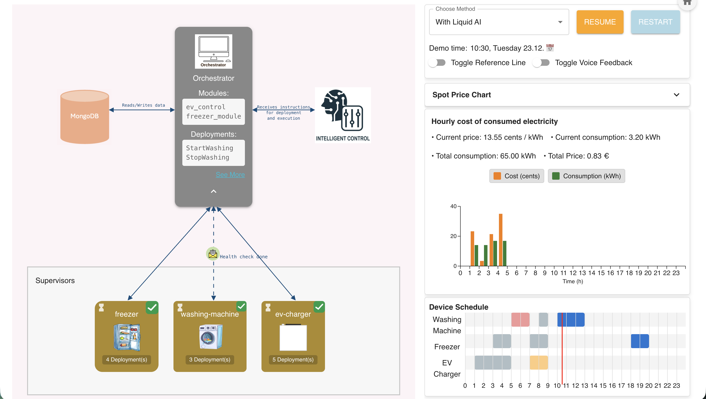

**Health Information:**
- Orchestrator connection status
- Supervisor availability
- Database connectivity
- API response times

### Query

Sends queries to devices to check their current state.

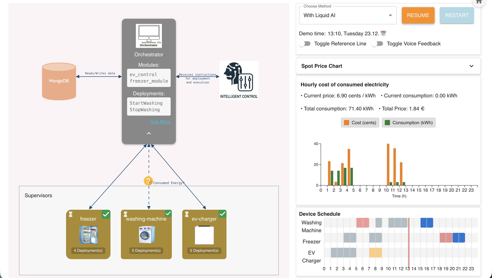

**Query Types:**
- Battery status queries (EV charger)
- Temperature queries (Freezer)
- Cycle status queries (Washing machine)

### Query Result

Views the response from device queries.

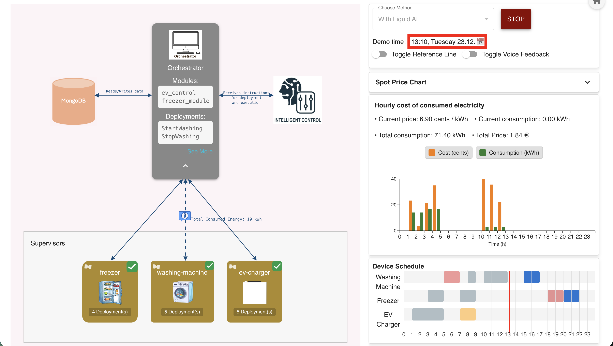

**Query Response Data:**
- Current device state
- Sensor readings
- Energy consumption data
- Operational parameters

---

## Quick Reference

### Demo Timeline

| Time | Event |
|------|-------|
| 00:30 | Cars arrive home, initial schedule created |
| 01:00 | EV charging begins |
| 03:00 | Freezer operation starts |
| 05:00 | Price spike - schedules recalculated |
| 06:20 | Power outage begins |
| 07:00 | V2G: Car 2 powers Freezer |
| 08:00 | V2G: Car 1 powers Washing Machine |
| 09:00 | Power restored, V2G ends |
| 10:00 | Cars leave, user requests washing machine |
| 13:00 | Price spike - washing machine rescheduled |
| 18:00 | Cars return, new charging schedule |
| 21:00 | Price spike - EV charging rescheduled |
| 23:50 | Demo restarts |

---

*Last Updated: December 2025*
